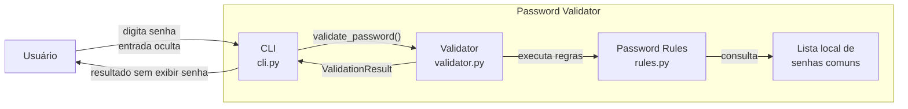
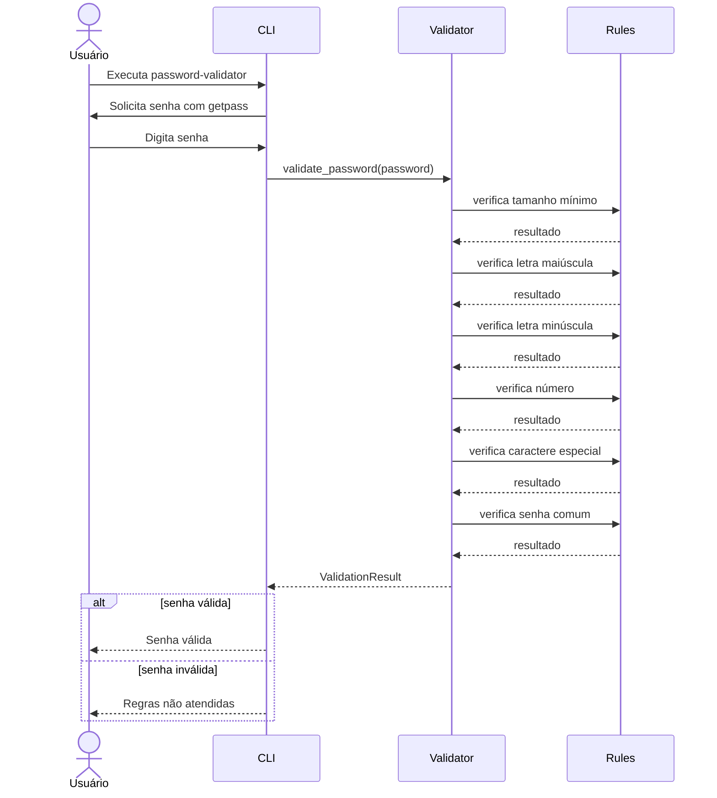

# Password Validator Python

Aplicação de linha de comando em Python para validar uma senha candidata contra uma política mínima de segurança. Este repositório também funciona como uma base de **documentação arquitetural versionável**, usando a abordagem **diagrams as code** com Mermaid.

## Funcionalidades

A política atual verifica se a senha:

- possui pelo menos 8 caracteres;
- contém letra maiúscula;
- contém letra minúscula;
- contém número;
- contém caractere especial;
- não pertence à lista local de senhas comuns.

A senha é lida com `getpass`, portanto não é exibida durante a digitação. O sistema não persiste, transmite ou registra a senha.

## Como executar

Requer Python 3.10 ou superior.

```bash
python -m venv .venv
```

Ative o ambiente virtual e instale o projeto:

```bash
pip install -e .[dev]
```

Execute:

```bash
password-validator
```

ou:

```bash
python -m password_validator.cli
```

Para executar os testes:

```bash
pytest -q
```

---

# Discovery de arquitetura — Unidade III

## 1. Descrição do sistema em linguagem natural

### Escopo

O **Password Validator** é uma aplicação local de linha de comando responsável por verificar se uma senha candidata atende a uma política mínima de validação.

O sistema é responsável por:

- receber uma senha por entrada oculta no terminal;
- aplicar regras de validação;
- identificar as regras não atendidas;
- devolver ao usuário apenas o resultado da validação;
- evitar que a senha seja exibida ou armazenada pela aplicação.

Não fazem parte do escopo atual:

- autenticação de usuários;
- cadastro de usuários;
- armazenamento de senhas;
- hashing de senhas;
- recuperação de senha;
- geração automática de senha;
- cálculo de entropia;
- consulta a bases externas de credenciais comprometidas;
- API web ou interface gráfica.

### Nível da visão

A documentação usa uma visão estrutural inspirada no nível de **containers/componentes do modelo C4**, adaptada ao tamanho do projeto.

Como se trata de uma aplicação pequena executada localmente, os principais elementos arquiteturais documentados são:

- CLI;
- Validator;
- Rules;
- lista local de senhas comuns.

### Limites e responsabilidades

**CLI (`cli.py`)**  
É a fronteira de interação com o usuário. Recebe a senha com `getpass`, chama o validador e apresenta o resultado sem imprimir a senha.

**Validator (`validator.py`)**  
Coordena a aplicação das regras e produz um `ValidationResult` contendo o estado final e as mensagens de erro.

**Rules (`rules.py`)**  
Contém as verificações individuais da política de senha e a denylist local de senhas comuns.

**Tests (`tests/`)**  
Verificam as regras, o comportamento do validador e propriedades de segurança observáveis na CLI.

### Integrações

A aplicação não possui integração externa em tempo de execução.

Ela usa:

- `getpass`, da biblioteca padrão do Python, para entrada oculta;
- `pytest` no ambiente de desenvolvimento para testes;
- GitHub Actions para integração contínua.

### Restrições

- Python 3.10 ou superior;
- execução local por linha de comando;
- senha não é aceita como argumento do terminal;
- senha não é persistida;
- senha não deve aparecer em `stdout` ou `stderr`;
- a versão atual usa uma lista local de senhas comuns.

### Lacunas conhecidas

Ainda não estão formalmente especificados:

- tamanho máximo de uma senha;
- política detalhada para caracteres Unicode;
- origem, abrangência e atualização da lista de senhas comuns;
- comportamento para entradas extremamente grandes;
- eventual uso de serviço de senhas comprometidas;
- versionamento da política de senhas;
- contrato de API caso o validador seja exposto como serviço;
- requisitos não funcionais de desempenho e disponibilidade para um cenário de serviço.

---

## 2. Diagrama estrutural

O diagrama abaixo representa os principais elementos do sistema e suas dependências em tempo de execução.



### Leitura do diagrama

A CLI funciona como fronteira do sistema. Ela obtém a senha de forma oculta e delega a decisão ao `validator.py`. O validador coordena as regras implementadas em `rules.py` e consolida os resultados em um `ValidationResult`. A senha permanece apenas em memória durante a execução e não existe componente de persistência.

O código-fonte Mermaid deste diagrama também está em [`docs/diagrams/structural.mmd`](docs/diagrams/structural.mmd).

---

## 3. Diagrama comportamental

A jornada crítica escolhida é a validação de uma senha informada pelo usuário.



O código-fonte Mermaid deste diagrama também está em [`docs/diagrams/sequence.mmd`](docs/diagrams/sequence.mmd).

---

## 4. Uso de GenAI, revisão e ajustes

A Inteligência Artificial Generativa foi utilizada para apoiar a transformação da descrição textual e do código existente em diagramas Mermaid. O conteúdo gerado não foi tratado como fonte definitiva: os diagramas foram comparados com o comportamento e com as responsabilidades efetivamente presentes no projeto antes de serem incorporados.

### O que o modelo inferiu corretamente

O modelo identificou corretamente:

- a separação entre interface CLI, coordenação da validação e regras individuais;
- o fluxo principal `CLI -> Validator -> Rules`;
- a validação como jornada crítica do sistema;
- a importância de representar a entrada oculta da senha;
- que a execução da validação não exige persistência.

### O que precisou ser ajustado

Durante a revisão, foram evitadas inferências que extrapolariam o sistema real:

- não foi incluído banco de dados, pois o sistema não persiste senhas;
- não foi incluída API externa de senhas comprometidas, pois essa integração não existe na versão atual;
- o projeto foi descrito como **validador de senha**, e não como sistema de autenticação;
- testes e GitHub Actions não foram colocados no fluxo principal de runtime, pois pertencem ao processo de qualidade e desenvolvimento;
- a lista de senhas comuns foi representada como recurso local, coerente com a implementação atual.

### O que faltaria para um agente construir o sistema sem inventar decisões

Embora a documentação descreva a arquitetura e o fluxo principal, um agente de desenvolvimento ainda precisaria de especificações adicionais para implementar ou evoluir o sistema sem assumir decisões implícitas:

- contrato formal das funções e tipos;
- catálogo definitivo das regras de senha;
- política de caracteres Unicode;
- tamanho máximo da entrada;
- especificação estável das mensagens de erro;
- fonte oficial e processo de atualização da lista de senhas comuns;
- requisitos de desempenho;
- requisitos de logging que garantam não exposição de segredos;
- critérios para integração futura com bases de senhas comprometidas;
- política de versionamento das regras;
- contrato e requisitos de segurança caso seja criada uma API.

Essa documentação adicional transformaria a arquitetura atual em uma especificação mais determinística para agentes de implementação.

---

## Estrutura do repositório

```text
Password-validator-python/
├── .github/
│   └── workflows/
│       └── tests.yml
├── docs/
│   ├── diagrams/
│   │   ├── sequence.mmd
│   │   └── structural.mmd
│   ├── architecture.md
│   └── risk-analysis.md
├── src/
│   └── password_validator/
│       ├── __init__.py
│       ├── cli.py
│       ├── rules.py
│       └── validator.py
├── tests/
│   ├── test_cli.py
│   ├── test_rules.py
│   └── test_validator.py
├── .gitignore
├── ALTERACOES.md
├── pyproject.toml
├── requirements.txt
└── README.md
```

## Documentação complementar

- [Arquitetura](docs/architecture.md)
- [Análise de riscos](docs/risk-analysis.md)
- [Histórico de alterações](ALTERACOES.md)

## Observação para a entrega da atividade

Além de publicar este repositório, a atividade solicita visitar o repositório de um colega e deixar uma sugestão. Essa interação deve ser realizada diretamente no repositório do colega e não pode ser representada apenas por um arquivo neste projeto.
